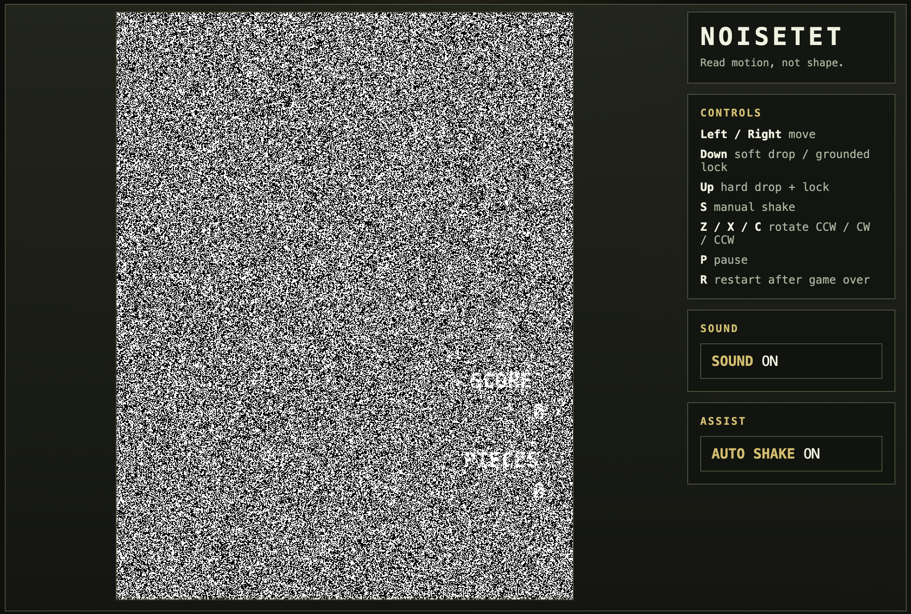

# NOISETET

A white-noise falling-block game where motion is the main source of readability.



## Concept

The board is intentionally hard to read when static. Pieces, impacts, line clears, queue motion, and reveals are what make the structure legible. The project is built around one gameplay engine and one presentation model, with the noise theme as the intended player-facing form.

## Features

- White-noise primary theme
- Solid theme for development and debugging
- High-spawn arcade-style rotation and movement rules
- 3-piece preview queue
- Hard drop on `Up`
- Manual shake on `S`
- Optional auto-shake assist
- Pause, sound toggle, and debug boot modes

## Screenshot

The repository includes a current gameplay screenshot at [`game.png`](./doc/game.png).

## Run Locally

Requirements:

- Node.js
- npm

Install dependencies:

```sh
npm install
```

Start the normal build:

```sh
npm run dev
```

Useful development modes:

```sh
npm run dev:debug
npm run dev:debug20g
npm run dev:noise
```

Build for production:

```sh
npm run build
```

Run checks:

```sh
npm run typecheck
npm test
```

## Controls

- `Left / Right`: Move
- `Z / X / C`: Rotate CCW / CW / CCW
- `Down`: Soft drop / grounded lock
- `Up`: Hard drop + lock
- `S`: Manual shake
- `P`: Pause
- `R`: Restart after game over

## Sidebar Options

- `SOUND`: Toggle gameplay audio on or off
- `AUTO SHAKE`: Toggle once-per-second shake assist

## Debug Notes

- `debug` and `debug20g` boot modes start paused
- `V` toggles theme only in debug modes
- normal mode always boots in the noise theme

## Project Structure

- [`src/core`](./src/core): deterministic gameplay rules
- [`src/presentation`](./src/presentation): shared motion and presentation state
- [`src/app`](./src/app): renderer, theme system, browser app shell, and audio
- [`doc/technical_design.txt`](./doc/technical_design.txt): implementation-oriented design specification

## Status

Playable browser build with gameplay, noise presentation, audio, assist options, and debug tooling in place.
